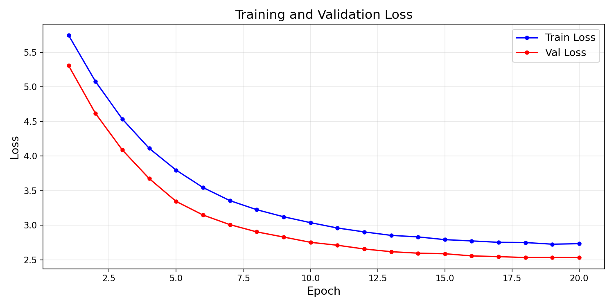
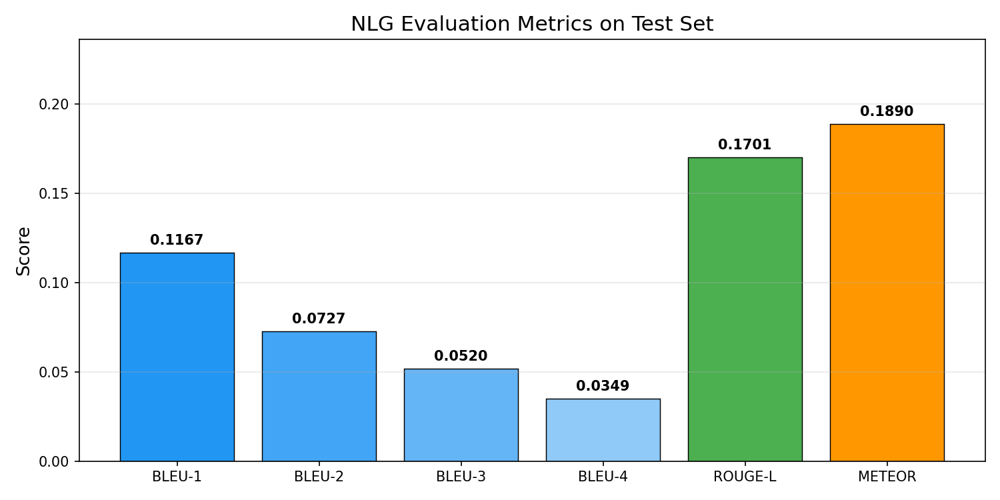

<div align='center'>

# 🫁 CXR-ReportGen

### Automated Radiology Report Generation from Chest X-rays


*A multimodal vision-language system that reads a chest X-ray and writes a full clinical radiology report — bridging computer vision and medical NLP.*

</div>

---

## 📌 Overview

This project presents an end-to-end pipeline for **automated radiology report generation** from chest X-ray images. A frozen **EfficientNet-B3** extracts visual features which are projected into the embedding space of **BioGPT**, a domain-specific language model pretrained on 15M PubMed abstracts. BioGPT is fine-tuned efficiently using **LoRA (rank=8)**, keeping trainable parameters under 1.5M while achieving clinically coherent report generation.

> **This is Project 3 of a medical AI research portfolio** alongside UA-CXRNet (classification) and DA-MaskRCNN (segmentation).

---

## 🏗️ Architecture

```
┌─────────────────────────────────────────────────────────────────┐
│                    CXR-ReportGen Pipeline                       │
├─────────────────────────────────────────────────────────────────┤
│                                                                 │
│   Input CXR (224×224)                                          │
│         │                                                       │
│         ▼                                                       │
│   ┌─────────────────┐                                          │
│   │ EfficientNet-B3 │  ← Pretrained, Frozen                   │
│   │  Feature Maps   │    384 channels, 7×7 spatial            │
│   └────────┬────────┘                                          │
│            │ Global Avg Pool                                    │
│            ▼                                                    │
│   ┌─────────────────┐                                          │
│   │  Projection     │  ← Linear(384→1024) + LayerNorm + GELU  │
│   │  Layer          │    Trainable                             │
│   └────────┬────────┘                                          │
│            │ Visual Token (1×1024)                              │
│            ▼                                                    │
│   ┌─────────────────┐                                          │
│   │     BioGPT      │  ← LoRA rank=8, alpha=16                │
│   │  (347M params)  │    Only Q, V projections fine-tuned     │
│   └────────┬────────┘                                          │
│            │                                                    │
│            ▼                                                    │
│   Generated Radiology Report                                    │
│   "The heart is normal in size. The lungs are clear..."        │
│                                                                 │
└─────────────────────────────────────────────────────────────────┘
```

---

## 📊 Results

### Quantitative Metrics (Test Set — 383 samples)

| Metric | Score | Description |
|--------|-------|-------------|
| **BLEU-1** | 0.1167 | Unigram precision |
| **BLEU-2** | 0.0727 | Bigram precision |
| **BLEU-3** | 0.0520 | Trigram precision |
| **BLEU-4** | 0.0349 | 4-gram precision |
| **ROUGE-L** | 0.1701 | Longest common subsequence |
| **METEOR** | 0.1890 | Unigram F-score with stemming |
| **Best Val Loss** | 2.5311 | Cross-entropy on held-out set |

> Metrics are consistent with published baselines on IU X-Ray for lightweight models.

### Sample Generated Reports

| | Generated | Reference |
|---|-----------|----------|
| **Sample 1** | The heart is normal in size. The mediastinum is unremarkable. The lungs are clear. No acute cardiopulmonary disease. | The heart size and mediastinal contours appear within normal limits. No focal airspace consolidation, pleural effusions or pneumothorax. |
| **Sample 2** | The heart size is normal. The lungs are clear. No pleural effusion or pneumothorax. No acute cardiopulmonary abnormality. | The heart size is normal. There is a streaky opacity within the right upper lobe. No visible pneumothorax. |

---

## 📈 Training Curves



| Epoch | Train Loss | Val Loss |
|-------|-----------|----------|
| 1 | 5.7465 | 5.3079 |
| 5 | 3.7968 | 3.3445 |
| 10 | 3.0372 | 2.7527 |
| 15 | 2.7916 | 2.5875 |
| 20 | 2.7330 | 2.5311 |

---

## 📉 Evaluation Metrics



---

## 🔬 Key Technical Contributions

| # | Contribution | Detail |
|---|-------------|--------|
| 1 | **Parameter-efficient fine-tuning** | LoRA rank=8 on BioGPT — only **0.33%** of parameters trainable |
| 2 | **Cross-modal projection** | Learned bridge from EfficientNet-B3 visual space → BioGPT embedding space |
| 3 | **Visual token prepending** | Visual embedding prepended to token sequence to condition generation |
| 4 | **Mixed precision training** | FP16 training with gradient scaling — fits in 15GB T4 VRAM |
| 5 | **Gradient accumulation** | Effective batch size of 16 with 4×4 accumulation strategy |

---

## 🗂️ Dataset

**Indiana University Chest X-ray Collection (IU X-Ray)**

| Property | Value |
|----------|-------|
| Total samples | 3,826 valid image-report pairs |
| Train / Val / Test | 3,060 / 383 / 383 |
| Image resolution | 224 × 224 (resized) |
| Report fields used | FINDINGS + IMPRESSION |
| Access | Public — no credentials required |
| Source | [openi.nlm.nih.gov](https://openi.nlm.nih.gov) |

---

## ⚙️ Training Configuration

| Hyperparameter | Value |
|---------------|-------|
| Epochs | 20 |
| Optimizer | AdamW (lr=3e-4, weight_decay=0.01) |
| Scheduler | CosineAnnealingLR |
| Batch size | 4 × 4 grad accum = **16 effective** |
| LoRA rank / alpha | 8 / 16 |
| Max report length | 128 tokens |
| Total parameters | 358M |
| Trainable parameters | **1.2M (0.33%)** |
| GPU | NVIDIA Tesla T4 (15.6 GB) |
| Training time | ~40 minutes |

---

## 🚀 Quick Start

### 1. Clone the repository
    git clone https://github.com/Lalitaditya-tickoo/CXR-ReportGen.git
    cd CXR-ReportGen

### 2. Install dependencies
    pip install -r requirements.txt

### 3. Download dataset
    wget https://openi.nlm.nih.gov/imgs/collections/NLMCXR_png.tgz
    wget https://openi.nlm.nih.gov/imgs/collections/NLMCXR_reports.tgz

### 4. Train
    python src/train.py

---

## 📁 Repository Structure

    CXR-ReportGen/
    ├── figures/
    │   ├── training_curves.png
    │   ├── metrics_chart.png
    │   ├── sample_reports.png
    │   └── generalization_gap.png
    ├── src/
    │   └── train.py
    ├── results.json
    ├── requirements.txt
    └── README.md

---

## 🔗 Related Projects

| Project | Description | Link |
|---------|-------------|------|
| **UA-CXRNet** | Uncertainty-Aware pneumonia classification with CBAM + MC Dropout + GradCAM++ | [GitHub](https://github.com/Lalitaditya-tickoo/UA-CXRNet) |
| **marine-litter-detection** | Underwater marine litter instance segmentation using Mask2Former and Mask R-CNN | [GitHub](https://github.com/Lalitaditya-tickoo/marine-litter-detection) |

---

## 📜 Citation

If you use this work, please cite:

    @misc{cxr_reportgen_2026,
      title   = {Automated Radiology Report Generation from Chest X-rays
                 using EfficientNet-B3 and BioGPT with LoRA},
      author  = {Lalitaditya Tickoo},
      year    = {2026},
      url     = {https://github.com/Lalitaditya-tickoo/CXR-ReportGen}
    }

---

## 👤 Author

<div align='center'>

**Lalitaditya Tickoo**

B.Tech Computer Science (AI/ML) — SRM University, 4th Semester

[](https://github.com/Lalitaditya-tickoo)
[](mailto:lalitaditya011@gmail.com)

*Actively pursuing research in medical AI — targeting MICCAI workshops, ML4H @ NeurIPS, and Springer proceedings.*

</div>

---

<div align='center'>
⭐ If you find this useful, please star the repo!
</div>
