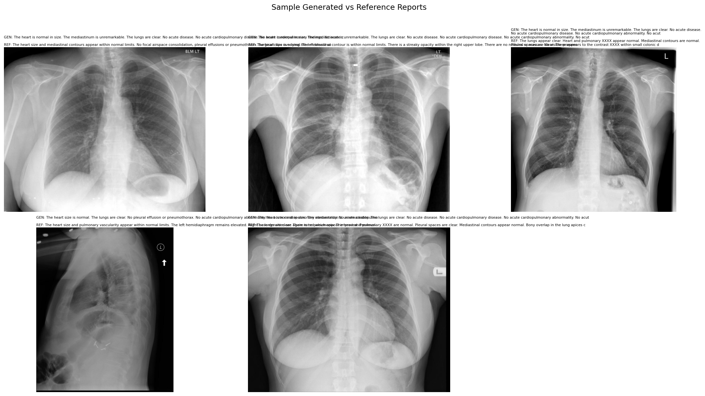
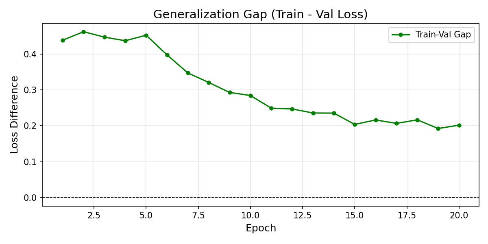

# CXR Report Generation — EfficientNet-B3 + BioGPT (LoRA)

A multimodal vision-language system that takes a chest X-ray as input and generates a full radiology report.

## Architecture

- **Vision Encoder:** EfficientNet-B3 (pretrained, frozen)
- **Projection:** Linear layer → BioGPT embedding dim (1024)
- **Language Model:** BioGPT fine-tuned with LoRA rank=8
- **Trainable params:** ~1.2M / 358M total (0.33%)

## Dataset

- IU X-Ray (Indiana University) — 3,826 image-report pairs
- Split: 80% train / 10% val / 10% test

## Results

| Metric  | Score  |
|---------|--------|
| BLEU-1  | 0.1167 |
| BLEU-2  | 0.0727 |
| BLEU-3  | 0.0520 |
| BLEU-4  | 0.0349 |
| ROUGE-L | 0.1701 |
| METEOR  | 0.1890 |

Best Validation Loss: **2.5311**

## Training Details

| Parameter | Value |
|-----------|-------|
| Epochs | 20 |
| Optimizer | AdamW lr=3e-4 |
| Batch size | 4 x 4 accum = 16 effective |
| LoRA rank | 8 |
| GPU | Tesla T4 15.6GB |
| Training time | ~40 minutes |

## Figures

### Training Curves

### Evaluation Metrics

### Sample Generated Reports

### Generalization Gap

## Requirements

    pip install transformers==4.40.0 peft==0.10.0 timm==0.9.16
    pip install rouge-score nltk sacremoses accelerate

## Author

**Lalitaditya** — B.Tech CSE (AI/ML), SRM University

Related projects:
- UA-CXRNet: Pneumonia classification with CBAM + MC Dropout + GradCAM++
- DA-MaskRCNN: Underwater marine litter instance segmentation
